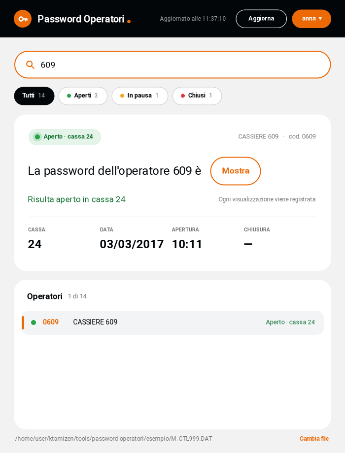
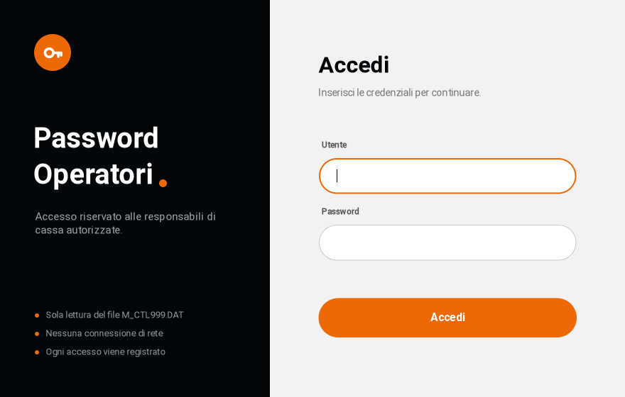
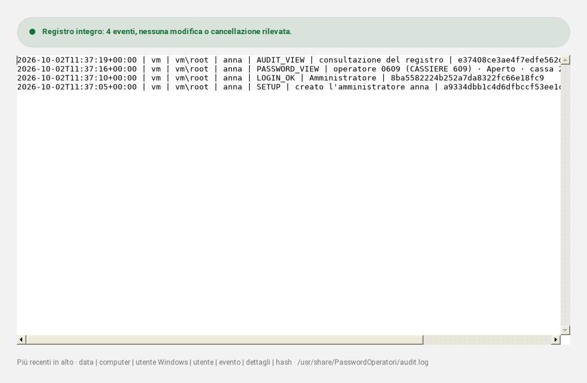

# Password Operatori

Piccola app Windows **portatile** (un solo `.exe`, nessuna installazione) per le responsabili
di cassa: legge `M_CTL999.DAT` e mostra password, cassa e stato di un operatore.
Grafica secondo il design system Terya (fondo #F2F2F2, nero #020609, accento #EC6906, Roboto, forme pill).







## Uso

1. Copiare `PasswordOperatori.exe` sul server (consigliato: `C:\Program Files\PasswordOperatori\`).
2. **Prima volta:** avviarlo con *Esegui come amministratore* e creare l'account amministratore.
3. Dal menu utente → *Gestione utenti*, creare un utente per ogni responsabile.
4. Le responsabili accedono con il proprio utente e digitano il codice operatore (es. `609`).

Risultato, ad esempio:

> La password dell'operatore 609 è **[Mostra]** — Risulta aperto in cassa 24

- Clic su **Mostra**: la password compare per 30 secondi e la visualizzazione viene registrata.
  Un secondo clic la copia negli appunti, che vengono ripuliti quando si nasconde.
- LED **verde** aperto, **giallo-arancio** in pausa, **rosso** chiuso, grigio non ancora aperto.
- Cassa, data, ora di apertura e ora di chiusura.
- Filtri rapidi: Tutti, Aperti, In pausa, Chiusi (con il conteggio).
- Scorciatoie: `Ctrl+F` cerca, `F5` aggiorna, `Esc` svuota la ricerca, `Invio`/`↓` vanno all'elenco.
- Il file viene riletto automaticamente ogni 3 secondi.

## Password dimenticata

La password non si può leggere (è salvata solo come hash), ma si può reimpostare:

- **Responsabile:** un amministratore la reimposta da menu utente → *Gestione utenti* → *Nuova password*.
- **Amministratore:** nella schermata di accesso, *Password dimenticata?* → il programma si riavvia come
  amministratore di Windows e permette di scegliere una nuova password. In alternativa:
  tasto destro sull'exe → *Esegui come amministratore* con il parametro `--recupero`
  (`PasswordOperatori.exe --recupero`). Gli altri utenti restano invariati e l'operazione
  finisce nel registro (`ADMIN_RESET`).

## Sicurezza

Dettagli completi, da girare ai clienti: [SICUREZZA.md](SICUREZZA.md).

- Il file del gestionale si apre **solo in lettura**. Il programma scrive solo in `%ProgramData%\PasswordOperatori`.
- **Nessuna connessione di rete.**
- Utenti personali con ruoli (responsabile, amministratore). Password salvate come hash PBKDF2-SHA256.
- Blocco dopo 5 tentativi errati e blocco automatico dopo 3 minuti di inattività.
- **Registro accessi** a catena di hash, protetto dai permessi NTFS (gli utenti possono solo aggiungere righe).

Il file viene cercato in quest'ordine:
1. percorso passato da riga di comando (`PasswordOperatori.exe D:\altro\M_CTL999.DAT`);
2. `C:\Server\Data\M_CTL999.DAT`;
3. la cartella dell'exe;
4. il primo `M_CTL*.DAT` in una delle due cartelle.

Con "Cambia file" in basso si può scegliere un altro file. Il file è aperto in **sola lettura**.

## Formato del file

```
0609:CASSIERE 609 :06090609:0024:09:01:170303:1011:0000
cod  nome          chiave    cassa pw stato data  apert chius
```

| Campo  | Esempio  | Significato                              |
|--------|----------|------------------------------------------|
| cassa  | `0024`   | cassa su cui l'operatore è stato aperto  |
| pw     | `09`     | password operatore                       |
| stato  | `01`     | `01` aperto · `02` chiuso · `08` pausa · `00` mai aperto |
| data   | `170303` | AAMMGG → 03/03/2017                      |
| apert. | `1011`   | 10:11                                    |
| chius. | `0000`   | non ancora chiuso                        |

I campi sono letti partendo da destra, quindi spazi nel nome non creano problemi.

## Compilare

Requisito: .NET Framework 4.x (già incluso in Windows 8/10/11 e Server 2012+).

Fare doppio clic su `build.bat`: usa il `csc.exe` presente in
`C:\Windows\Microsoft.NET\Framework\v4.0.30319\` e genera `PasswordOperatori.exe`,
con il font Roboto (cartella `fonts`, licenza Apache 2.0) e l'icona incorporati.

Il codice è diviso in tre file: `PasswordOperatori.cs` (interfaccia), `Security.cs` (utenti, hash, registro,
permessi) e `AdminForms.cs` (configurazione, utenti, registro). Percorso predefinito, tempi di blocco e
regole delle password sono nella classe `Config`. Al termine `build.bat` stampa l'impronta SHA-256 dell'exe.

In `esempio/M_CTL999.DAT` c'è un file di prova.
